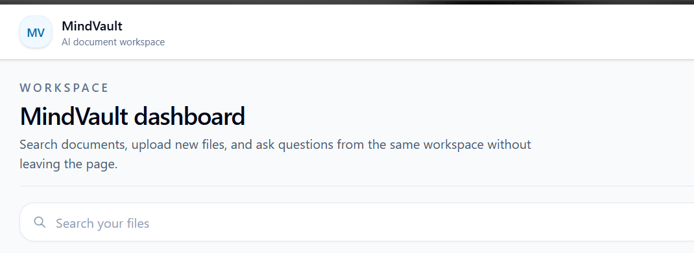
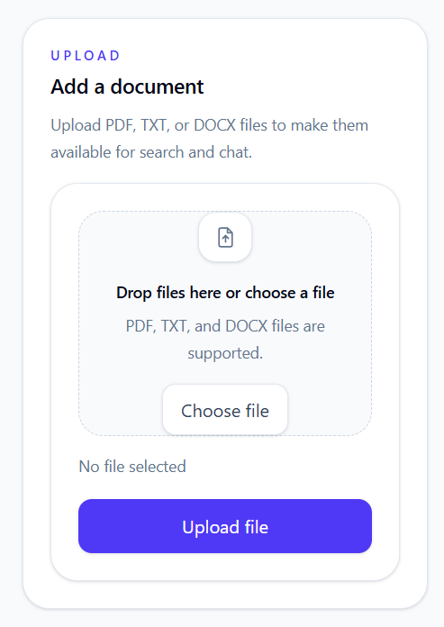
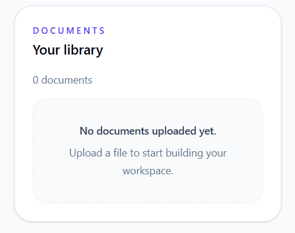
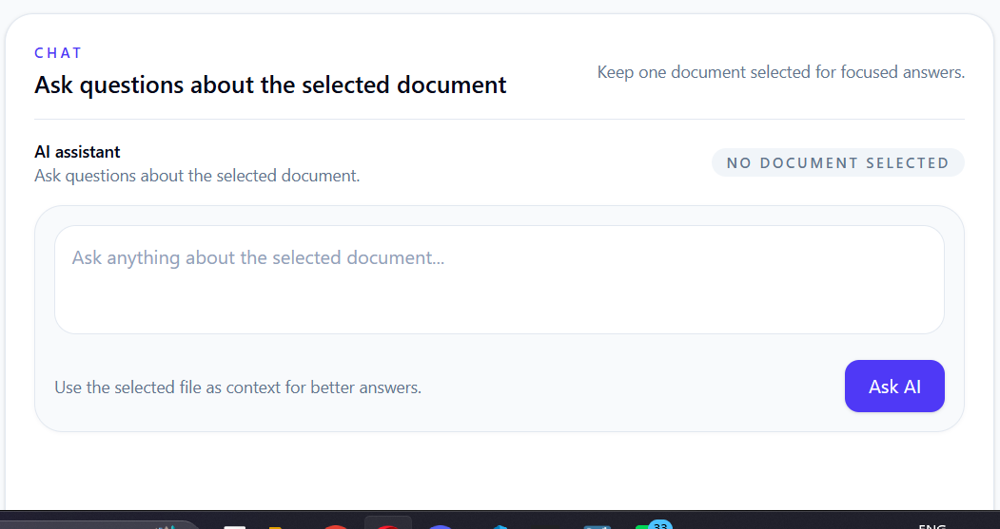

<div align="center">

# 🧠 MindVault

### AI-Powered Document Workspace

Upload your documents, search your personal knowledge base, and ask AI questions using natural language—all from one modern workspace.

<br>

🌐 **Live Demo:** https://mindvault-seven-chi.vercel.app

💻 **Repository:** https://github.com/nidhisanni/second-brain

</div>

---

## ✨ Overview

MindVault is an AI-powered document workspace that allows users to securely upload documents, organize them in a personal library, search through their files, and interact with them using Google's Gemini AI.

Instead of manually opening PDFs or Word documents to find information, users can simply upload their files and ask questions in natural language.

Each user's documents are securely isolated using Clerk Authentication and Supabase Row Level Security (RLS).

---

## 🚀 Features

- 🔐 Secure authentication with Clerk
- 📂 Upload PDF, DOCX and TXT files
- ☁️ Cloud storage using Supabase Storage
- 🔍 Instant document search
- 🤖 AI-powered document Q&A using Gemini
- 📑 Personal document library
- 🗑️ Delete uploaded documents
- 👤 User-specific document isolation with RLS
- ⚡ Responsive modern dashboard
- 🌍 Live deployment on Vercel

---

# 📸 Screenshots

## Dashboard



---

## Upload Documents



---

## Document Library



---

## AI Assistant



# 🛠️ Tech Stack

## Frontend

- Next.js 16
- React
- TypeScript
- Tailwind CSS

## Authentication

- Clerk

## Database

- Supabase PostgreSQL

## File Storage

- Supabase Storage

## AI

- Google Gemini API

## Deployment

- Vercel

---

# 🏗️ Architecture

```text
                ┌────────────────────────┐
                │       User             │
                └──────────┬─────────────┘
                           │
                    Next.js Dashboard
                           │
          ┌────────────────┼─────────────────┐
          │                │                 │
          │                │                 │
      Clerk Auth      Supabase DB     Gemini API
          │                │                 │
          │          Document Metadata       │
          │                │                 │
          │         Supabase Storage         │
          │                │                 │
          └────────────────┴─────────────────┘
                   AI Responses + Documents
```

---

# 📂 Project Structure

```text
MindVault
│
├── app/
│   ├── api/
│   ├── sign-in/
│   ├── sign-up/
│   └── page.tsx
│
├── components/
│   ├── Navbar.tsx
│   ├── SearchBar.tsx
│   ├── UploadCard.tsx
│   ├── DocumentList.tsx
│   └── ChatBox.tsx
│
├── context/
│
├── lib/
│
├── services/
│
├── public/
│
├── screenshots/
│
└── README.md
```

---

# ⚙️ Installation

Clone the repository

```bash
git clone https://github.com/nidhisanni/second-brain.git
```

Go into the project

```bash
cd second-brain
```

Install dependencies

```bash
npm install
```

Create a `.env.local` file and add the required environment variables.

Run the development server

```bash
npm run dev
```

Open:

```
http://localhost:3000
```

---

# 🔑 Environment Variables

Create a `.env.local` file with the following variables:

```env
NEXT_PUBLIC_SUPABASE_URL=

NEXT_PUBLIC_SUPABASE_PUBLISHABLE_KEY=

NEXT_PUBLIC_CLERK_PUBLISHABLE_KEY=

CLERK_SECRET_KEY=

SUPABASE_SERVICE_ROLE_KEY=

GEMINI_API_KEY=
```

# ⚡ How It Works

### 1. Authentication

Users securely sign in using **Clerk Authentication**. Every user has their own private workspace.

---

### 2. Upload Documents

Users can upload:

- PDF
- DOCX
- TXT

Files are stored in **Supabase Storage**, while document metadata is stored in **Supabase PostgreSQL**.

---

### 3. Search

Documents can be searched instantly using the search bar, making it easy to find files from your personal library.

---

### 4. AI Chat

After selecting a document, users can ask questions in natural language.

The application:

- Retrieves the selected document
- Uses the document content as context
- Sends the prompt to the **Google Gemini API**
- Displays the AI-generated response

---

### 5. Delete Documents

Users can remove unwanted documents.

Deleting a document removes:

- the file from Supabase Storage
- the metadata from the database

---

# 🔒 Security

MindVault follows secure development practices.

- Clerk Authentication for user identity
- Supabase Row Level Security (RLS)
- User-specific document isolation
- Protected API keys using environment variables
- Secure cloud storage

Every user can only access their own uploaded documents.

---

# ⭐ Key Highlights

- Modern dashboard UI
- Responsive layout
- Secure authentication
- Cloud document storage
- AI-powered document assistant
- Fast document search
- Clean component-based architecture
- Live deployment on Vercel

---

# 🚧 Challenges Faced

During development, several technical challenges were solved:

- Integrating Clerk authentication with Next.js
- Configuring Supabase Row Level Security (RLS)
- Managing secure file uploads
- Handling document deletion from both Storage and Database
- Deploying a full-stack application on Vercel
- Connecting Gemini AI for document-based question answering

These improvements resulted in a more secure, scalable, and production-ready application.

---

# 📈 Future Improvements

- Semantic search using embeddings
- Vector database integration
- Multi-document AI conversations
- AI-generated document summaries
- Folder and tag organization
- Shareable document links
- OCR support for scanned PDFs
- Usage analytics dashboard
- Dark mode
- Mobile application

---

# 💻 Author

**Nidhi Sanni**

Aspiring Software Development Engineer passionate about building scalable AI-powered applications using modern web technologies.

- GitHub: https://github.com/nidhisanni
- LinkedIn: https://www.linkedin.com/in/nidhisanni/

---

# 🌐 Live Demo

🚀 https://mindvault-seven-chi.vercel.app

---

# 📂 Repository

💻 https://github.com/nidhisanni/second-brain

---

# 🙏 Acknowledgements

This project was built using:

- Next.js
- React
- TypeScript
- Tailwind CSS
- Clerk Authentication
- Supabase
- Google Gemini API
- Vercel

Special thanks to the open-source community for creating amazing developer tools.

---

# 📄 License

This project is licensed under the MIT License.

---

<div align="center">

## ⭐ If you found this project useful, consider giving it a star!

Built with ❤️ using **Next.js**, **Supabase**, **Clerk**, and **Google Gemini AI**.

</div>
